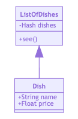
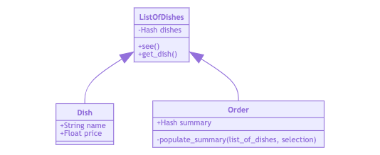
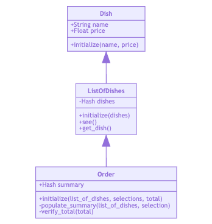

Takeaway Challenge
==================
```
                            _________
              r==           |       |
           _  //            |  M.A. |   ))))
          |_)//(''''':      |       |
            //  \_____:_____.-------D     )))))
           //   | ===  |   /        \
       .:'//.   \ \=|   \ /  .:'':./    )))))
      :' // ':   \ \ ''..'--:'-.. ':
      '. '' .'    \:.....:--'.-'' .'
       ':..:'                ':..:'

```

Task
-----


* Write a Takeaway program with the following user stories:

```
As a customer
So that I can check if I want to order something
I would like to see a list of dishes with prices

As a customer
So that I can order the meal I want
I would like to be able to select some number of several available dishes

As a customer
So that I can verify that my order is correct
I would like to check that the total I have been given matches the sum of the various dishes in my order

As a customer
So that I am reassured that my order will be delivered on time
I would like to receive a text such as "Thank you! Your order was placed and will be delivered before 18:52" after I have ordered
```

## Getting started
```
# clone the repository to your local machine with either

# if you're using ssh
git clone git@github.com:PhilipVigus/takeaway-challenge.git

# if you're using https
git clone https://github.com/PhilipVigus/takeaway-challenge.git

# Dependencies
# The repository requires bundle, which can be installed with
gem install bundle

# then run bundle from the root project directory to install other dependencies
bundle
```

### Setting the project up to send text messages

One of the key functionalities of this project sends text messages. If you want your cloned version to do the same, there is some additional setup:

- set up an account with Twilio
- create a file called 'twilio_credentials.env' in the project's root directory with the following contents:

```
ACCOUNT_SID=your_twilio_account_sid_goes_here
AUTH_TOKEN=your_auth_token_goes_here
ORDER_PHONE_NUMBER=the_number_to_send_texts_to_goes_here
TAKEAWAY_PHONE_NUMBER=the_number_to_send_texts_from_goes_here
```
The project is set up so that git ignores this file, as it contains personal information.

## Running tests

Note that running the test will **not** send any texts, as that method has been stubbed out in the relevant test.

```
# Runs the full test suite from the root project directory
rspec
```

## Approach

My initial work on this task involved roughing out a basic domain model on paper from the user stories. This was very approximate and just gave me a rough idea as to how things related to each other and what classes, methods and variables might exist.

I then worked through the user stories one by one, following Behavioural Driven Design. In the following sections I have included each user story along with a rough class diagram for the code at that stage and an example of using the feature in irb.

It should be noted that the diagrams are not intended to be accurate UML (particularly the arrow types and directions), and are just intended to give an overview of the relationship between the different units of code at eacch stage of development.

### 1st user story

```
As a customer
So that I can check if I want to order something
I would like to see a list of dishes with prices
```

#### Feature - You must be able to see the list of dishes



My initial approach to this story was a ListOfDishes class containing a simple array with the names and prices of each dish, but I quickly decided to refactor this into the two classes you see here. I decided to use a hash as it was easier and more intuitive to access individual dishes by name rather than their index.

I was (and still am) torn on the name ListOfDishes. The obvious classname here is Menu, and I was itching to use it all through the challenge. However, I decided to stick to ListOfDishes as that is the language used in the user story.

Here is an example of using the feature in irb:

```
2.6.5 :001 > require './lib/list_of_dishes'
 => true 
2.6.5 :002 > stew = Dish.new("Stew", 2)
 => #<Dish:0x00007fb6009910c0 @name="Stew", @price=2> 
2.6.5 :003 > rice = Dish.new("Rice", 1)
 => #<Dish:0x00007fb6009a34a0 @name="Rice", @price=1> 
2.6.5 :004 > list = ListOfDishes.new([stew, rice])
 => #<ListOfDishes:0x00007fb60093ed70 @dishes={"Stew"=>#<Dish:0x00007fb6009910c0 @name="Stew", @price=2>, "Rice"=>#<Dish:0x00007fb6009a34a0 @name="Rice", @price=1>}> 
2.6.5 :005 > list.see
 => {"Stew"=>#<Dish:0x00007fb6009910c0 @name="Stew", @price=2>, "Rice"=>#<Dish:0x00007fb6009a34a0 @name="Rice", @price=1>
```

### 2nd user story

```
As a customer
So that I can order the meal I want
I would like to be able to select some number of several available dishes
```

#### Feature - You must be able to select some number of several available dishes



It took me a while to decide on the best way of defining the selection of dishes that make up an order. I eventually when for a hash, with the keys being the dish names and the values being the quantity of each dish. This seemed the most intuitive approach, and made the code easier to read.

populate_summary does all the work in the Order class, marrying up data from the order selection with the price information from a ListOfDishes instance.

Here is an example of using the feature in irb:

```
2.6.5 :001 > require './lib/order'
{:stew=>{:quantity=>3, :price=>1}, :rice=>{:quantity=>4, :price=>2}}
 => true 
2.6.5 :002 > rice = Dish.new('rice', 2)
 => #<Dish:0x00007fe938466c88 @name=:rice, @price=2> 
2.6.5 :003 > stew = Dish.new('stew', 1)
 => #<Dish:0x00007fe9384a7cd8 @name=:stew, @price=1> 
2.6.5 :004 > list = ListOfDishes.new([rice, stew])
 => #<ListOfDishes:0x00007fe9384bfec8 @dishes={:rice=>#<Dish:0x00007fe938466c88 @name=:rice, @price=2>, :stew=>#<Dish:0x00007fe9384a7cd8 @name=:stew, @price=1>}> 
2.6.5 :005 > order = Order.new(list, {stew: 3, rice: 4}, 11)
 => #<Order:0x00007fe9384cd190 @summary={:stew=>{:quantity=>3, :price=>1}, :rice=>{:quantity=>4, :price=>2}}> 
2.6.5 :006 > order.summary
 => {:stew=>{:quantity=>3, :price=>1}, :rice=>{:quantity=>4, :price=>2}} 
```

### 3rd user story

```
As a customer
So that I can verify that my order is correct
I would like to check that the total I have been given matches the sum of the various dishes in my order
```

#### Feature - You must be able to verify the total I have been given



With the code I already had, I found this relatively straightforward to implement, with the work done in a new private verify_total method.

Here is an example of using the feature in irb:

```
2.6.5 :001 > require './lib/order'
{:stew=>{:quantity=>3, :price=>1}, :rice=>{:quantity=>4, :price=>2}}
 => true 
2.6.5 :002 > rice = Dish.new('rice', 2)
 => #<Dish:0x00007fe938466c88 @name=:rice, @price=2> 
2.6.5 :003 > stew = Dish.new('stew', 1)
 => #<Dish:0x00007fe9384a7cd8 @name=:stew, @price=1> 
2.6.5 :004 > list = ListOfDishes.new([rice, stew])
 => #<ListOfDishes:0x00007fe9384bfec8 @dishes={:rice=>#<Dish:0x00007fe938466c88 @name=:rice, @price=2>, :stew=>#<Dish:0x00007fe9384a7cd8 @name=:stew, @price=1>}> 
2.6.5 :005 > order = Order.new(list, {stew: 3, rice: 4}, 11)
 => #<Order:0x00007fe9384cd190 @summary={:stew=>{:quantity=>3, :price=>1}, :rice=>{:quantity=>4, :price=>2}}> 
2.6.5 :006 > order.summary
 => {:stew=>{:quantity=>3, :price=>1}, :rice=>{:quantity=>4, :price=>2}} 
2.6.5 :007 > order = Order.new(list, {stew: 3, rice: 4}, 13)
Traceback (most recent call last):
        8: from /Users/student/.rvm/rubies/ruby-2.6.5/bin/irb:23:in `<main>'
        7: from /Users/student/.rvm/rubies/ruby-2.6.5/bin/irb:23:in `load'
        6: from /Users/student/.rvm/rubies/ruby-2.6.5/lib/ruby/gems/2.6.0/gems/irb-1.0.0/exe/irb:11:in `<top (required)>'
        5: from (irb):8
        4: from (irb):8:in `new'
        3: from /Users/student/projects/takeaway-challenge/lib/order.rb:11:in `initialize'
        2: from /Users/student/projects/takeaway-challenge/lib/order.rb:36:in `verify_total'
        1: from /Users/student/projects/takeaway-challenge/lib/order.rb:41:in `raise_total_verification_error'
ArgumentError (incorrect order total. Total given = 13. Actual = 11)

```

### 4th user story

```
As a customer
So that I am reassured that my order will be delivered on time
I would like to receive a text such as "Thank you! Your order was placed and will be delivered before 18:52" after I have ordered
```

#### Feature - The user must be sent a text when they put in a valid order, confirming when it will be delivered


This story was tough to implement, and including a number of stages.
- the dotenv gem was used to hide sensitive user date from being stored on the repo
- the twilio-ruby gem was used to send the actual text
- I also had to set the tests up so that texts were not sent if they were run. This was achieved using dependency injection to pass an instance of the text handler (or a double if it in the case of testing the class)

Refactoring the new code out into a TextHandler class made a lot of sense, as it clearly didn't belong in Order. This kept things nice and clean.

***Please note - if you have your environmental variables set up as discussed in the set-up section, running this feature test  will actually send a text.***

```
2.6.5 :001 > require './lib/order'
{:stew=>{:quantity=>3, :price=>1}, :rice=>{:quantity=>4, :price=>2}}
 => true 
2.6.5 :002 > rice = Dish.new('rice', 2)
 => #<Dish:0x00007fe938466c88 @name=:rice, @price=2> 
2.6.5 :004 > stew = Dish.new('stew', 1)
 => #<Dish:0x00007fe9384a7cd8 @name=:stew, @price=1> 
2.6.5 :005 > list = ListOfDishes.new([rice, stew])
 => #<ListOfDishes:0x00007fe9384bfec8 @dishes={:rice=>#<Dish:0x00007fe938466c88 @name=:rice, @price=2>, :stew=>#<Dish:0x00007fe9384a7cd8 @name=:stew, @price=1>}> 
2.6.5 :006 > order = Order.new(list, {stew: 3, rice: 4}, 11)
 => #<Order:0x00007fe9384cd190 @summary={:stew=>{:quantity=>3, :price=>1}, :rice=>{:quantity=>4, :price=>2}}> 
2.6.5 :010 > order.send_text(TextHandler.new)
 => # ACTUAL OUTPUT REMOVED AS IT CONTAINS PERSONAL INFORMATION
```

### Improvements still to make

- Extracting a Selection class out of Order to represent individual dish selections and quantities.